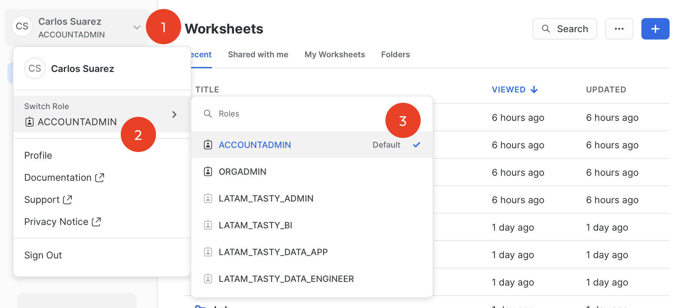
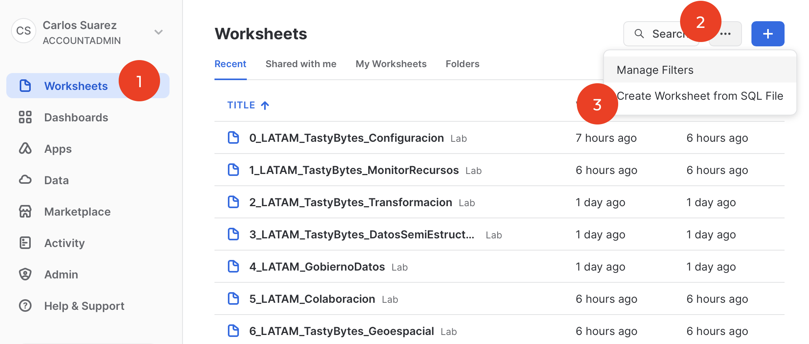
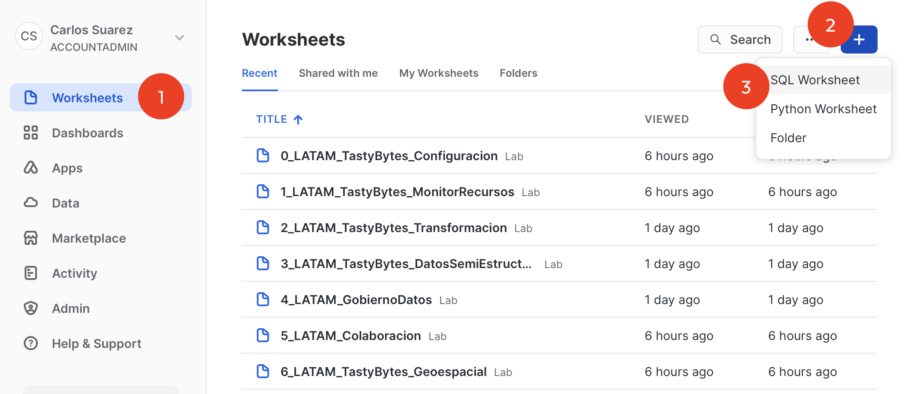
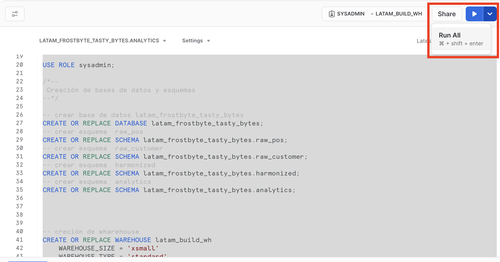

# Laboratorio - Zero to Snowflake

En este laboratorio permite implementar diferentes casos de uso sobre una empresa ficticia llamada TastyBytes usando datos de Snowflake Marketplace (Clima y Geografía) así como carga de datos desde external stage en AWS S3.

## ¿Qué es TastyBytes?

Es una red mundial de camiones de comida, opciones de menú localizadas, 15 países, 30 ciudades principales y 15 marcas principales.

## Requerimientos
- Crear una cuenta de prueba Snowflake https://signup.snowflake.com/

# Configuración y carga de datos

Para realziar la configuración, una vez teniendo activa la cuenta Snowflake

## Paso 1: Activar el rol ACCOUNTADMIN

## Paso 2: Cargar el archivo 0_LATAM_TastyBytes_Configuracion.sql
Opción 1 - cargar desde opicón "Create Worksheet From SQL File", se abrira  una ventana de selección del sistema operativo y elegir donde este almacenado el archivo SQL.

Opció 2 - cargar desde opción "Create a SQL Worksheet", se puede abrir el archivo SQL en un navegador, copiar y pegar el código dentro de la nueva Worksheet recien creado.

## Paso 3: Ejecutar todo el código SQL
Selecionar todo el código SQL y ejecutar todo en un solo paso.

# Proyecto

Una vez completado el paso 1 y paso 2 de configuración, el proyecto propone 6 etapas, que van desde la creación de aleertas y cuotas de uso de virtual warehouse (cómputo), tranformar datosde origen usando sentencias SQL, implementar de forma ágil el tipo de dato VARIANT de Snowflake para extraer dede JSON en tabla valores específicos, Gobierno de datos para a través de Tags definiendo políticas para enmascarar datos sensibles y privados así como segmentación por renglón, aplicar colaboración de datos para acceder a datos desde Snowflake marketplace para clima y geografía.

- Monitor de recursos
 1_LATAM_TastyBytes_MonitorRecursos.sql
- Transformación
 2_LATAM_TastyBytes_Transformacion.sql
- Datos Semi-Estrcuturado
 3_LATAM_TastyBytes_DatosSemiEstructurados.sql
- Gobierno de Datos
 4_LATAM_GobiernoDatos.sql
- Colaboración
 5_LATAM_Colaboracion.sql
- Geoespacial 
 6_LATAM_TastyBytes_Geoespacial.sql